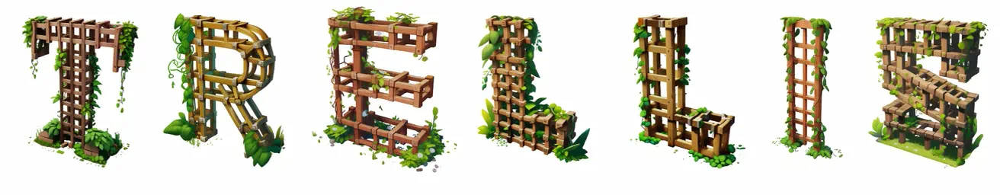
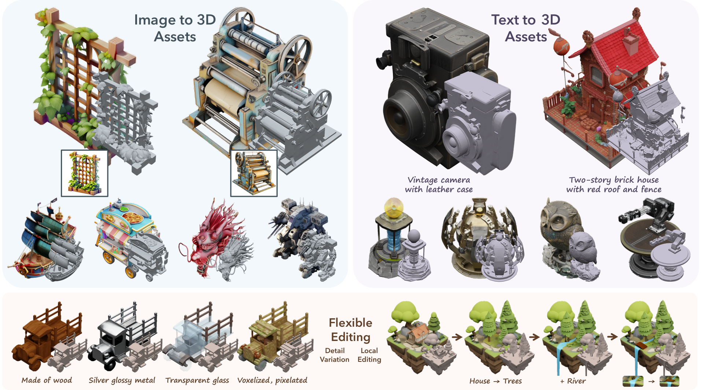

<h1 align="center">Structured 3D Latents<br>for Scalable and Versatile 3D Generation</h1>
<p align="center"><a href="https://arxiv.org/abs/2412.01506"></a>
<a href='https://trellis3d.github.io'></a>
<a href='https://huggingface.co/spaces/JeffreyXiang/TRELLIS'></a>
</p>
<p align="center"></p>

<span style="font-size: 16px; font-weight: 600;">T</span><span style="font-size: 12px; font-weight: 700;">RELLIS</span> is a large 3D asset generation model. It takes in text or image prompts and generates high-quality 3D assets in various formats, such as Radiance Fields, 3D Gaussians, and meshes. The cornerstone of <span style="font-size: 16px; font-weight: 600;">T</span><span style="font-size: 12px; font-weight: 700;">RELLIS</span> is a unified Structured LATent (<span style="font-size: 16px; font-weight: 600;">SL</span><span style="font-size: 12px; font-weight: 700;">AT</span>) representation that allows decoding to different output formats and Rectified Flow Transformers tailored for <span style="font-size: 16px; font-weight: 600;">SL</span><span style="font-size: 12px; font-weight: 700;">AT</span> as the powerful backbones. We provide large-scale pre-trained models with up to 2 billion parameters on a large 3D asset dataset of 500K diverse objects. <span style="font-size: 16px; font-weight: 600;">T</span><span style="font-size: 12px; font-weight: 700;">RELLIS</span> significantly surpasses existing methods, including recent ones at similar scales, and showcases flexible output format selection and local 3D editing capabilities which were not offered by previous models.

***Check out our [Project Page](https://trellis3d.github.io) for more videos and interactive demos!***

<!-- Features -->
## 🌟 Features
- **High Quality**: It produces diverse 3D assets at high quality with intricate shape and texture details.
- **Versatility**: It takes text or image prompts and can generate various final 3D representations including but not limited to *Radiance Fields*, *3D Gaussians*, and *meshes*, accommodating diverse downstream requirements.
- **Flexible Editing**: It allows for easy editings of generated 3D assets, such as generating variants of the same object or local editing of the 3D asset.

<!-- Updates -->
## ⏩ Updates

**12/26/2024**
- Release **TRELLIS-500K** dataset and toolkits for data preparation.

**12/18/2024**
- Implementation of multi-image conditioning for TRELLIS-image model. ([#7](https://github.com/microsoft/TRELLIS/issues/7)). This is based on tuning-free algorithm without training a specialized model, so it may not give the best results for all input images.
- Add Gaussian export in `app.py` and `example.py`. ([#40](https://github.com/microsoft/TRELLIS/issues/40))

<!-- TODO List -->
## 🚧 TODO List
- [x] Release inference code and TRELLIS-image-large model
- [x] Release dataset and dataset toolkits
- [ ] Release TRELLIS-text model series
- [ ] Release training code

<!-- Installation -->
## 📦 Installation

### Prerequisites
- **System**: The code is currently tested only on **Linux**.  For windows setup, you may refer to [#3](https://github.com/microsoft/TRELLIS/issues/3) (not fully tested).
- **Hardware**: An NVIDIA GPU with at least 16GB of memory is necessary. The code has been verified on NVIDIA A100 and A6000 GPUs.  
- **Software**:   
  - The [CUDA Toolkit](https://developer.nvidia.com/cuda-toolkit-archive) is needed to compile certain submodules. The code has been tested with CUDA versions 11.8 and 12.2.  
  - [Conda](https://docs.anaconda.com/miniconda/install/#quick-command-line-install) is recommended for managing dependencies.  
  - Python version 3.8 or higher is required. 

### Installation Steps
1. Clone the repo:
    ```sh
    git clone --recurse-submodules https://github.com/microsoft/TRELLIS.git
    cd TRELLIS
    ```

2. Install the dependencies:
    
    **Before running the following command there are somethings to note:**
    - By adding `--new-env`, a new conda environment named `trellis` will be created. If you want to use an existing conda environment, please remove this flag.
    - By default the `trellis` environment will use pytorch 2.4.0 with CUDA 11.8. If you want to use a different version of CUDA (e.g., if you have CUDA Toolkit 12.2 installed and do not want to install another 11.8 version for submodule compilation), you can remove the `--new-env` flag and manually install the required dependencies. Refer to [PyTorch](https://pytorch.org/get-started/previous-versions/) for the installation command.
    - If you have multiple CUDA Toolkit versions installed, `PATH` should be set to the correct version before running the command. For example, if you have CUDA Toolkit 11.8 and 12.2 installed, you should run `export PATH=/usr/local/cuda-11.8/bin:$PATH` before running the command.
    - By default, the code uses the `flash-attn` backend for attention. For GPUs do not support `flash-attn` (e.g., NVIDIA V100), you can remove the `--flash-attn` flag to install `xformers` only and set the `ATTN_BACKEND` environment variable to `xformers` before running the code. See the [Minimal Example](#minimal-example) for more details.
    - The installation may take a while due to the large number of dependencies. Please be patient. If you encounter any issues, you can try to install the dependencies one by one, specifying one flag at a time.
    - If you encounter any issues during the installation, feel free to open an issue or contact us.
    
    Create a new conda environment named `trellis` and install the dependencies:
    ```sh
    . ./setup.sh --new-env --basic --xformers --flash-attn --diffoctreerast --spconv --mipgaussian --kaolin --nvdiffrast
    ```
    The detailed usage of `setup.sh` can be found by running `. ./setup.sh --help`.
    ```sh
    Usage: setup.sh [OPTIONS]
    Options:
        -h, --help              Display this help message
        --new-env               Create a new conda environment
        --basic                 Install basic dependencies
        --xformers              Install xformers
        --flash-attn            Install flash-attn
        --diffoctreerast        Install diffoctreerast
        --vox2seq               Install vox2seq
        --spconv                Install spconv
        --mipgaussian           Install mip-splatting
        --kaolin                Install kaolin
        --nvdiffrast            Install nvdiffrast
        --demo                  Install all dependencies for demo
    ```

<!-- Pretrained Models -->
## 🤖 Pretrained Models

We provide the following pretrained models:

| Model | Description | #Params | Download |
| --- | --- | --- | --- |
| TRELLIS-image-large | Large image-to-3D model | 1.2B | [Download](https://huggingface.co/JeffreyXiang/TRELLIS-image-large) |
| TRELLIS-text-base | Base text-to-3D model | 342M | Coming Soon |
| TRELLIS-text-large | Large text-to-3D model | 1.1B | Coming Soon |
| TRELLIS-text-xlarge | Extra-large text-to-3D model | 2.0B | Coming Soon |

The models are hosted on Hugging Face. You can directly load the models with their repository names in the code:
```python
TrellisImageTo3DPipeline.from_pretrained("JeffreyXiang/TRELLIS-image-large")
```

If you prefer loading the model from local, you can download the model files from the links above and load the model with the folder path (folder structure should be maintained):
```python
TrellisImageTo3DPipeline.from_pretrained("/path/to/TRELLIS-image-large")
```

<!-- Usage -->
## 💡 Usage

### Minimal Example

Here is an [example](example.py) of how to use the pretrained models for 3D asset generation.

```python
import os
# os.environ['ATTN_BACKEND'] = 'xformers'   # Can be 'flash-attn' or 'xformers', default is 'flash-attn'
os.environ['SPCONV_ALGO'] = 'native'        # Can be 'native' or 'auto', default is 'auto'.
                                            # 'auto' is faster but will do benchmarking at the beginning.
                                            # Recommended to set to 'native' if run only once.

import imageio
from PIL import Image
from trellis.pipelines import TrellisImageTo3DPipeline
from trellis.utils import render_utils, postprocessing_utils

# Load a pipeline from a model folder or a Hugging Face model hub.
pipeline = TrellisImageTo3DPipeline.from_pretrained("JeffreyXiang/TRELLIS-image-large")
pipeline.cuda()

# Load an image
image = Image.open("assets/example_image/T.png")

# Run the pipeline
outputs = pipeline.run(
    image,
    seed=1,
    # Optional parameters
    # sparse_structure_sampler_params={
    #     "steps": 12,
    #     "cfg_strength": 7.5,
    # },
    # slat_sampler_params={
    #     "steps": 12,
    #     "cfg_strength": 3,
    # },
)
# outputs is a dictionary containing generated 3D assets in different formats:
# - outputs['gaussian']: a list of 3D Gaussians
# - outputs['radiance_field']: a list of radiance fields
# - outputs['mesh']: a list of meshes

# Render the outputs
video = render_utils.render_video(outputs['gaussian'][0])['color']
imageio.mimsave("sample_gs.mp4", video, fps=30)
video = render_utils.render_video(outputs['radiance_field'][0])['color']
imageio.mimsave("sample_rf.mp4", video, fps=30)
video = render_utils.render_video(outputs['mesh'][0])['normal']
imageio.mimsave("sample_mesh.mp4", video, fps=30)

# GLB files can be extracted from the outputs
glb = postprocessing_utils.to_glb(
    outputs['gaussian'][0],
    outputs['mesh'][0],
    # Optional parameters
    simplify=0.95,          # Ratio of triangles to remove in the simplification process
    texture_size=1024,      # Size of the texture used for the GLB
)
glb.export("sample.glb")

# Save Gaussians as PLY files
outputs['gaussian'][0].save_ply("sample.ply")
```

After running the code, you will get the following files:
- `sample_gs.mp4`: a video showing the 3D Gaussian representation
- `sample_rf.mp4`: a video showing the Radiance Field representation
- `sample_mesh.mp4`: a video showing the mesh representation
- `sample.glb`: a GLB file containing the extracted textured mesh
- `sample.ply`: a PLY file containing the 3D Gaussian representation


### Web Demo

[app.py](app.py) provides a simple web demo for 3D asset generation. Since this demo is based on [Gradio](https://gradio.app/), additional dependencies are required:
```sh
. ./setup.sh --demo
```

After installing the dependencies, you can run the demo with the following command:
```sh
python app.py
```

Then, you can access the demo at the address shown in the terminal.

***The web demo is also available on [Hugging Face Spaces](https://huggingface.co/spaces/JeffreyXiang/TRELLIS)!***


<!-- Dataset -->
## 📚 Dataset

We provide **TRELLIS-500K**, a large-scale dataset containing 500K 3D assets curated from [Objaverse(XL)](https://objaverse.allenai.org/), [ABO](https://amazon-berkeley-objects.s3.amazonaws.com/index.html), [3D-FUTURE](https://tianchi.aliyun.com/specials/promotion/alibaba-3d-future), [HSSD](https://huggingface.co/datasets/hssd/hssd-models), and [Toys4k](https://github.com/rehg-lab/lowshot-shapebias/tree/main/toys4k), filtered based on aesthetic scores. Please refer to the [dataset README](DATASET.md) for more details.

<!-- License -->
## ⚖️ License

TRELLIS models and the majority of the code are licensed under the [MIT License](LICENSE). The following submodules may have different licenses:
- [**diffoctreerast**](https://github.com/JeffreyXiang/diffoctreerast): We developed a CUDA-based real-time differentiable octree renderer for rendering radiance fields as part of this project. This renderer is derived from the [diff-gaussian-rasterization](https://github.com/graphdeco-inria/diff-gaussian-rasterization) project and is available under the [LICENSE](https://github.com/JeffreyXiang/diffoctreerast/blob/master/LICENSE).


- [**Modified Flexicubes**](https://github.com/MaxtirError/FlexiCubes): In this project, we used a modified version of [Flexicubes](https://github.com/nv-tlabs/FlexiCubes) to support vertex attributes. This modified version is licensed under the [LICENSE](https://github.com/nv-tlabs/FlexiCubes/blob/main/LICENSE.txt).


<!-- Citation -->
## 📜 Citation

If you find this work helpful, please consider citing our paper:

```bibtex
@article{xiang2024structured,
    title   = {Structured 3D Latents for Scalable and Versatile 3D Generation},
    author  = {Xiang, Jianfeng and Lv, Zelong and Xu, Sicheng and Deng, Yu and Wang, Ruicheng and Zhang, Bowen and Chen, Dong and Tong, Xin and Yang, Jiaolong},
    journal = {arXiv preprint arXiv:2412.01506},
    year    = {2024}
}
```

